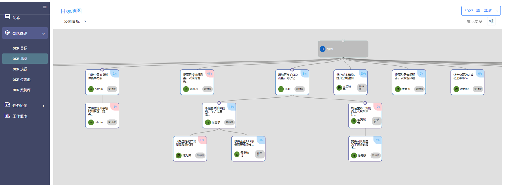

# 开箱可用全逻辑OKR管理系统

#### 介绍
业界顶级的OKR管理和执行逻辑
支持目标关联的任务和项目管理
开箱可用
可授权源码二次开发
[体验地址](https://okr.bj-qicai.com/)用户名：admin，密码：okre1234

#### 功能模块说明

功能模块简介
OKR目标
目标拆解，目标对齐，关键结果
信心指数，进度，结果评分，复盘
 

OKR地图
系统根据目标间的关联性自动生成目标地图提供整体视角。
 

OKR执行
通过 OKR 工作法，自动将单个目标的进展与执行生成四象限看板
 

OKR仪表盘
对 公司内OKR 的执行情况进行多维度监控，为管理者提供基于数据的决策依据。
 
OKR案例库
系统提供数百各行业OKR案例，方便各行业各岗位用户参考设计自己的OKR。
 

任务计划表
为支撑OKR执行的任务提供管理功能。
 
项目协同
为支撑OKR执行的项目提供项目管理功能。

 

 
报告总结
提供日周月报的管理。
 

工作报表
对系统内各项数据进行分析汇总。
 

管理后台
对系统的数据和权限进行设置和管理。
 

#### 安装教程

1.  xxxx
2.  xxxx
3.  xxxx

#### 使用说明

1.  xxxx
2.  xxxx
3.  xxxx

#### 参与贡献

1.  Fork 本仓库
2.  新建 Feat_xxx 分支
3.  提交代码
4.  新建 Pull Request

#### 特技

1.  使用 Readme\_XXX.md 来支持不同的语言，例如 Readme\_en.md, Readme\_zh.md
2.  Gitee 官方博客 [blog.gitee.com](https://blog.gitee.com)
3.  你可以 [https://gitee.com/explore](https://gitee.com/explore) 这个地址来了解 Gitee 上的优秀开源项目
4.  [GVP](https://gitee.com/gvp) 全称是 Gitee 最有价值开源项目，是综合评定出的优秀开源项目
5.  Gitee 官方提供的使用手册 [https://gitee.com/help](https://gitee.com/help)
6.  Gitee 封面人物是一档用来展示 Gitee 会员风采的栏目 [https://gitee.com/gitee-stars/](https://gitee.com/gitee-stars/)
